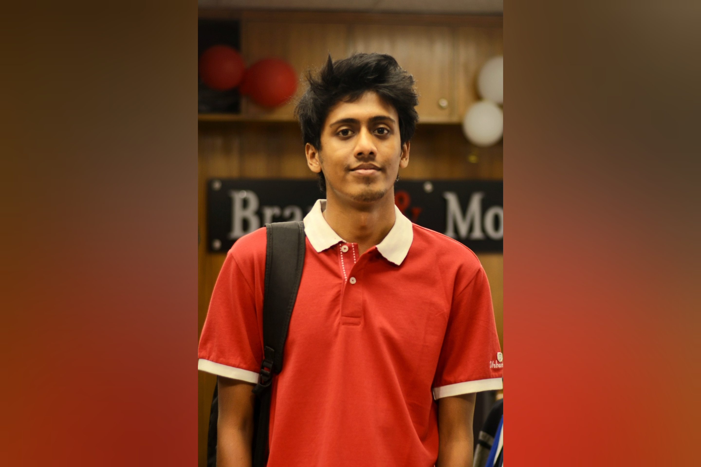

### HELLO WORLD!
* * *
<br>

### Contents
* <a href = "/project/" target="_blank"> Projects and Research </a>
* <a href = "/page2/" target="_blank"> Hobby and Others </a>

<br>

* * * 

<br>





### About Me
```
Hello! I am Abdur Rahman Fahad, currently a final year student 
doing B.Sc. in Computer Science and Engineering.
I am passionate about problem solving and software development. 
I am also interested in Data Analysis, Machine
Learning, Android Development and Computer Security.
```
<br>


<br>

### Technical Skills

|      |         |
|:-----|:--------|
| Language | `C++` `Python` `Java` `GNU Octave`  `Shell script` `Javascript` |
| Framework | `HTML5` `CSS3` `Express JS`|
| Database | `PostgreSQL` `Oracle` `MongoDB` |
| Version Control | `Git` `Github` |
| OS | `Windows` `Linux` |
| Development | `Android` `Web` |

<br>


<br>

### Education

| DEGREE       | INSTITUTE          | YEAR | 
|:-------------|:------------------|:------| 
| BSc          | Bangladesh University of Engineering and Technology | 2017 - 2022  |
| HSC          | Notre Dame College, Dhaka | 2014 - 2016  | 
| SSC          |   Rajuk Uttara Model College   | 2014  | 

<br>


<br>

### Achievements

#### 7th in Intra Buet Junior Programming Competition, CSE FEST 2018

###### Achieved 7th position in Intra Buet Junior Programming Contest arranged by, Department of Computer Science, BUET, during CSE FEST 2018.

<br>


#### University Stipend

###### Got Technical Scholarship from BUET in Level 1 - Term 1 in 2017.

<br>


#### Government Scholarship in HSC

###### Got scholarship in general grade in Higher Secondary School Certificate Examination in 2016.


<br>

#### Government Scholarship in SSC

###### Got scholarship in general grade in Secondary School Certificate Examination in 2014.

<br>

#### Government Scholarship and 13th Place in Dhaka Education Board

###### Got scholarship in Talentpool in Primary Scholarship Examination in 2008.

<br>

<br>


### Competitive Programming Profiles

<code><a href="https://codeforces.com/profile/1605069" target="_blank"></a></code>
<code><a href="https://www.hackerrank.com/fahad69?hr_r=1" target="_blank"></a></code>
<code><a href="https://toph.co/u/fahad_69" target="_blank"></a></code>
<code><a href="https://www.codechef.com/users/fahad69" target="_blank"></a></code>

<br>

<br>

* * *

##### Find me on

<code><a href="https://github.com/AbdurRahmanFahad" target="_blank"></a></code>
<code><a href="https://www.linkedin.com/in/abdur-rahman-fahad-a24091183/" target="_blank"></a></code>
<code><a href="https://www.facebook.com/fahad1605069" target="_blank"></a></code>
<code><a href="https://www.instagram.com/__fahad_rahman__/" target="_blank"></a></code>
<code><a href="https://www.flickr.com/photos/153952100@N04/" target="_blank"></a></code>

<br>
